<p align="center">
  
  
  
</p>
<p align="center">
  
  
  
  
  
  
</p>

<h1 align="center">🌀 Cyclo-Nexus</h1>
<h3 align="center">AI/ML-Based System for Identification, Classification & Prediction of Tropical Cyclone Patterns Using Multi-Source Satellite Data</h3>

<p align="center">
  <b>Problem Statement SIH26070 • Disaster Management • Team Tikka Techies (136905)</b><br/>
  <i>Real-time ISRO INSAT-3DS + NASA IMERG satellite intelligence • JTWC/IBTrACS official feeds • Physics-informed deep learning • Multilingual public safety advisories</i>
</p>

---

## 📋 Table of Contents

- [Problem Statement](#-problem-statement)
- [Our Solution](#-our-solution)
- [Feature Status — Done, In Progress, Planned](#-feature-status--done-in-progress-planned)
- [Key Features](#-key-features)
- [System Architecture](#-system-architecture)
- [End-to-End Data Flow](#-end-to-end-data-flow)
- [Technology Stack](#-technology-stack)
- [Module Deep Dive](#-module-deep-dive)
  - [Phase 1: Data Pipeline](#phase-1-data-pipeline--satellite-ingestion)
  - [Phase 2: Computer Vision](#phase-2-computer-vision--yolo-obb-cyclone-detection)
  - [Phase 3: Trajectory Forecasting](#phase-3-trajectory-forecasting--convlstm--bi-gru)
  - [Phase 4: Backend API](#phase-4-backend-api-gateway)
  - [Phase 5: Frontend PWA](#phase-5-frontend-pwa--public-safety-interface)
- [IMD Classification Scale](#-imd-7-tier-classification-scale)
- [Physics-Informed AI](#-physics-informed-ai)
- [Explainability (XAI)](#-explainability--grad-cam)
- [Multilingual Advisory System](#-multilingual-advisory-system)
- [API Reference](#-api-reference)
- [Deployment Architecture](#-deployment-architecture)
- [Impact & Exposure Engine](#-impact--exposure-engine)
- [Security Flow](#-security-flow)
- [Testing & Validation](#-testing--validation)
- [Limitations — Stated Honestly](#-limitations--stated-honestly)
- [Roadmap](#-roadmap)
- [Project Structure](#-project-structure)
- [Getting Started](#-getting-started)
- [Real-World Impact](#-real-world-impact)
- [Team](#-team)

---

## 🎯 Problem Statement

The **North Indian Ocean (NIO)** basin — encompassing the **Bay of Bengal** and **Arabian Sea** — experiences some of the world's deadliest tropical cyclones. Despite advancements in meteorology, existing early warning systems face critical challenges:

India has **11,098 km** of coastline ([MoPSW revision, 2025](https://shipmin.gov.in/en/content/revised-length-indias-coastline-0)) and **3.77 million marine fisherfolk** ([CMFRI census 2016](http://eprints.cmfri.org.in/17490/)). The NIO produces about **10 cyclonic disturbances a year** (472 systems in IBTrACS since 1980), roughly 4 out of 5 of them in the Bay of Bengal. Cyclone Amphan (2020) alone cost India about **US$14 billion** ([WMO 2020](https://theprint.in/india/amphan-costliest-cyclone-in-north-indian-ocean-resulted-in-loss-of-14-billion-un-report/642754/)).

> **The 1999 Odisha Super Cyclone killed 9,887 people. The comparable Cyclone Phailin in 2013 killed about 45 — because close to 1 million people were evacuated in time ([World Bank](https://www.worldbank.org/en/results/2014/04/10/india-averts-cyclone-phailin-devastation)).** Just 24 hours of warning can cut damage by ~30% ([Global Commission on Adaptation 2019, via WMO](https://wmo.int/news/media-centre/early-warning-systems-must-protect-everyone-within-five-years)).

| Challenge | Impact |
|-----------|--------|
| **Warning lead time** | Coastal communities often receive warnings just 12–24 hours before landfall |
| **Language barriers** | Official bulletins are primarily in English, leaving rural populations underserved |
| **Information fragmentation** | Data scattered across agencies and formats (satellite HDF5 files, English-only texts, PDFs) |
| **Weak systems ignored** | Depressions that can intensify quickly get little public attention until they are named |
| **Limited AI integration** | India's own INSAT-3DS satellite imagery is underutilized for automated detection |
| **Accessibility gap** | No unified, zero-cost, citizen-friendly platform for cyclone intelligence |

**The 1999 cyclone caused US$4.44 billion in damage and destroyed ~2 million tonnes of rice.** Even a few additional hours of warning can save thousands of lives and billions in economic losses.

---

## 💡 Our Solution

**Cyclo-Nexus** is a free, open web platform that watches the North Indian Ocean with live ISRO and NASA satellite data, flags developing tropical disturbances, and turns official cyclone warnings into clear multilingual advisories. It features **two layers shown side by side**: an *official layer* that is always correct (warnings from forecasting agencies) and a *satellite AI layer* that adds analysis and early-watch areas, clearly marked experimental.

The platform:

1. **Ingests live satellite data** from ISRO's INSAT-3DS (via MOSDAC) and NASA GPM IMERG precipitation data every 30 minutes
2. **Detects cyclones** using a custom **YOLO-OBB model** adapted for 4-channel multi-spectral satellite imagery, backed by a **physics-based satellite detector** that identifies organised deep convection
3. **Forecasts trajectories** using a **ConvLSTM + Bi-GRU spatiotemporal neural network** with physics-informed loss functions (Atkinson-Holliday wind-pressure relationship)
4. **Classifies intensity** using the **IMD 7-tier scale** (Depression → Super Cyclonic Storm)
5. **Generates multilingual public safety advisories** in English and Hindi with actionable directives for citizens, fishermen, and administration
6. **Serves a real-time interactive map** through a responsive React PWA with MapLibre GL, showing official system tracking, AI-derived satellite analysis, and watch areas

```
┌─────────────────────────────────────────────────────────────────────────────┐
│                        CYCLO-NEXUS PLATFORM OVERVIEW                       │
│                                                                             │
│   🛰️ INSAT-3DS  ──┐                                                        │
│   🌧️ NASA IMERG ──┼──▶  AI Detection & Forecasting  ──▶  📡 API Server    │
│   📊 JTWC/IBTrACS ┘         (PyTorch)                     (Express)       │
│                                                               │             │
│                                                               ▼             │
│                                                    🌐 React PWA (Vercel)   │
│                                                    ├─ Live Cyclone Map      │
│                                                    ├─ Safety Advisories     │
│                                                    ├─ Impact Assessment     │
│                                                    └─ Emergency Contacts    │
└─────────────────────────────────────────────────────────────────────────────┘
```

---

## ✅ Feature Status — Done, In Progress, Planned

Legend: ✅ working and tested · 🔄 implemented, being trained / calibrated / deployed · 🗺️ planned

| Area | Feature | Status |
|---|---|---|
| **Data** | Live INSAT-3DS L1C download from ISRO MOSDAC (token auth, resumable, paginated search) | ✅ |
| | Live NASA GPM IMERG Early rainfall from GES DISC (Earthdata login) | ✅ |
| | Official JTWC warnings + IBTrACS active storms, polled every 30 min | ✅ |
| | 45 seasons of IBTrACS North Indian Ocean best tracks (1980 → today, 18,179 points) | ✅ |
| | Live wind grid, sea-surface temperature, point weather + 3-day forecast (Open-Meteo) | ✅ |
| | Himawari-9 (JMA) and scatterometer (ASCAT / SCATSAT) winds as extra channels | 🗺️ |
| **AI** | 6-frame × 3-hour, 4-channel 1024² tensor assembly with LUT calibration | ✅ |
| | Physics detector (Deviation-Angle Variance + cold cloud + rain + SST + land mask) | ✅ validated on real cases |
| | YOLO-OBB oriented-box detector (serving pipeline) | ✅ serving · 🔄 retraining on real INSAT imagery |
| | ConvLSTM + Bi-GRU **multi-horizon** forecaster (one head per 6/12/24/48/72 h) with Atkinson–Holliday loss | ✅ code + tests · 🔄 training on real windows |
| | Grad-CAM explainability | 🔄 module + tests present, not yet in live path |
| | Ensemble forecasts and uncertainty cone | 🗺️ |
| **Impact** | People and towns in the strong-wind zone and core, now and along the forecast track | ✅ |
| | Typical deaths / damage of similar recorded storms (median, in ₹) | ✅ |
| | Storm-surge and inundation layers (INCOIS) | 🗺️ |
| **Alerts** | Template advisories for fishermen / public / administration in English + Hindi | ✅ |
| | 9-language interface (en, hi, ta, te, ml, bn, or, kn, mr) | ✅ UI · 🔄 advisory text beyond EN/HI after native-speaker review |
| | SMS / WhatsApp / push notifications, Sachet (CAP) integration | 🗺️ |
| **Web** | Public home page, live map (satellite / wind / rain / SST), tap-anywhere cyclone check, "check my area", safety guide, emergency numbers | ✅ |
| | Expert panel (analysis, forecasts, impact, advisories, climatology, system health) | ✅ |
| | Past-storms explorer with per-storm impact | ✅ |
| | Installable PWA with offline cache | 🔄 manifest + service worker present |
| **Ops** | HMAC-SHA256 + gzip webhooks, replay protection, heartbeat, "data delayed" banner | ✅ |
| | Free-tier deployment kit (Oracle VM + Hostinger + Vercel), Dockerfile | ✅ written · 🔄 deploying |

---

## ✨ Key Features

### 🛰️ Real-Time Satellite Intelligence
- Live INSAT-3DS multi-spectral imagery (TIR1, WV, Split-Window) at 30-minute cadence
- NASA GPM IMERG precipitation rate fusion for rainfall estimation
- Automated 6-frame temporal window construction (frames at t₀−15 h … t₀, every 3 hours)
- Frame caching with provenance tracking

### 🔍 Dual Detection System
- **Physics-Based Detector**: Deviation-Angle Variance organisation + coldest cloud top + rain core + persistence — **0 / 6 false-alarm days** on the real validation set at the chosen threshold
- **YOLO-OBB Deep Learning**: Oriented Bounding Box detection on 4-channel satellite imagery with custom weight surgery for multi-spectral input
- Both systems work together: physics detector provides the primary watch signal; YOLO adds supplementary candidates

### 🌀 Multi-Horizon Trajectory Forecasting
- ConvLSTM + Bidirectional GRU architecture for spatiotemporal sequence prediction
- Five forecast horizons, **one output head each**: **+6h, +12h, +24h, +48h, +72h**
- Multi-task output: position (lat/lon deltas), wind intensity, pressure drop
- Atkinson-Holliday physics constraint ensures wind-pressure consistency

### 📊 IMD-Compliant Classification
- All 7 IMD intensity tiers with deterministic classification from wind speed
- Alert level mapping: 🟡 Yellow (D/DD), 🟠 Orange (CS/SCS), 🔴 Red (VSCS/ESCS/SuCS)
- Cross-validated against the Pydantic telemetry contract

### 🗣️ Multilingual Advisory System
- Template-based advisory generation (deterministic — no hallucinations)
- Separate directives for **General Public**, **Fishermen**, and **Administration**
- Currently supports **English** and **Hindi**; extensible to all scheduled languages

### 🗺️ Interactive Public Safety Map
- MapLibre GL dark-mode map centered on the NIO basin
- Official vs. AI-derived data clearly badged
- **Tap anywhere**: place name, full weather report + 3-day forecast, and whether a cyclone is nearby or could form there
- **Check my area**: local risk, weather, cyclone history since 1980 and population nearby
- **Impact**: people in the storm's path and typical losses of similar storms (in ₹)
- Wind particle canvas visualization
- Cooperative gestures for mobile devices
- Historical cyclone database (IBTrACS NI, 1980–present) with per-storm impact cards
- Live map layers: NASA satellite imagery, animated wind particles, IMERG rain, GHRSST sea temperature

### 🔒 Security & Reliability
- HMAC-SHA256 signed webhooks with replay protection (timestamp-bound signatures)
- Rate limiting, Helmet.js security headers, timing-safe comparison
- Zip-bomb guard with 2MB wire limit
- Stale-data banner when satellite pipeline is delayed
- `/health` endpoint with per-component freshness reporting

---

## 🏗️ System Architecture

### High-Level Architecture Diagram

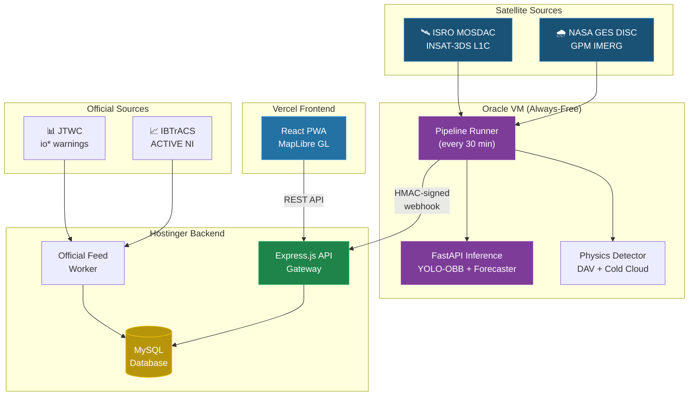

### Inter-Service Communication

```mermaid
sequenceDiagram
    participant S as 🛰️ Satellite Sources
    participant P as Pipeline Runner
    participant I as Inference API
    participant B as Backend API
    participant DB as MySQL
    participant F as Frontend PWA

    rect rgb(45, 45, 75)
        Note over S,P: Every 30 minutes
        S->>P: INSAT-3DS HDF5 + GPM NetCDF
        P->>P: Build 6×(4,1024,1024) tensor window
        P->>I: uint8 compressed tensor (~15 MB)
        I->>P: YOLO OBB + forecaster output
        P->>P: Physics detector + SST validation
        P->>B: HMAC-signed GeoJSON webhook
        B->>DB: Upsert cyclone + forecast data
    end

    rect rgb(45, 75, 45)
        Note over F,B: User request
        F->>B: GET /api/v1/cyclones
        B->>DB: Query active systems
        DB->>B: Cyclone records
        B->>F: JSON response
        F->>F: Render map + advisories
    end
```

---

## 🔄 End-to-End Data Flow

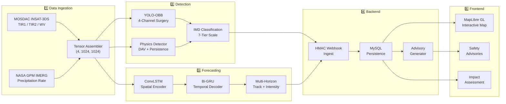

---

## 🛠️ Technology Stack

| Layer | Technology | Purpose |
|-------|-----------|---------|
| **Satellite Ingestion** | Python, h5py, netCDF4, NumPy | Raw satellite data download, extraction & regridding |
| **Computer Vision** | PyTorch, Ultralytics YOLOv8-OBB | Cyclone eye detection with oriented bounding boxes |
| **Forecasting** | PyTorch (custom ConvLSTM + Bi-GRU) | Spatiotemporal trajectory & intensity prediction |
| **Physics Engine** | Custom Pydantic models | Atkinson-Holliday wind-pressure validation |
| **Inference Server** | FastAPI, Uvicorn | GPU/CPU model serving with memory guard |
| **Backend API** | Express.js, Node.js 18+ | REST gateway, webhook ingest, advisory generation |
| **Database** | MySQL | Cyclone telemetry, advisories, historical tracks |
| **Frontend** | React 18, Vite, MapLibre GL | Interactive map, PWA, multilingual UI |
| **Schema Contracts** | Pydantic (Python), Zod (JS) | Cross-service type safety |
| **Security** | HMAC-SHA256, Helmet.js, rate-limit | Webhook auth, DDoS protection, secure headers |
| **Deployment** | Vercel, Hostinger, Oracle Cloud | Zero-cost production hosting |

---

## 🔬 Module Deep Dive

### Phase 1: Data Pipeline — Satellite Ingestion

> **Directory**: `data_pipeline/`

The data pipeline is the foundation of the platform, responsible for ingesting raw satellite imagery from two space agencies and fusing them into a unified 4-channel tensor.

#### Multi-Sensor Tensor Fusion

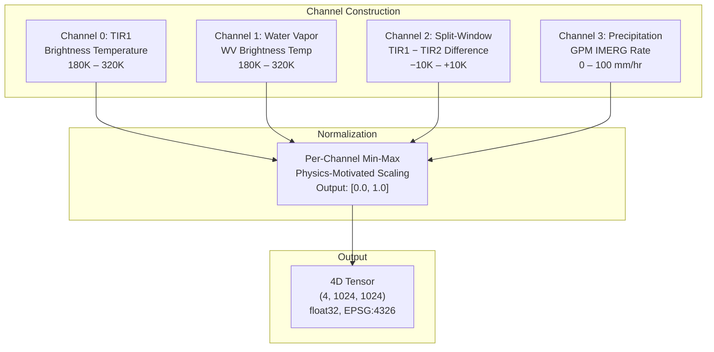

| Parameter | Value |
|-----------|-------|
| **Grid Resolution** | 1024 × 1024 pixels |
| **Projection** | EPSG:4326 (WGS-84) |
| **Geographic Bounds** | 0°N–32°N, 50°E–102°E (entire NIO basin) |
| **Temporal Window** | 6 frames × 3-hour steps (t₀−15 h … t₀) |
| **Output dtype** | float32 ∈ [0, 1]; sent to inference as uint8 (83 MB → 15 MB) |

#### Live Pipeline Architecture

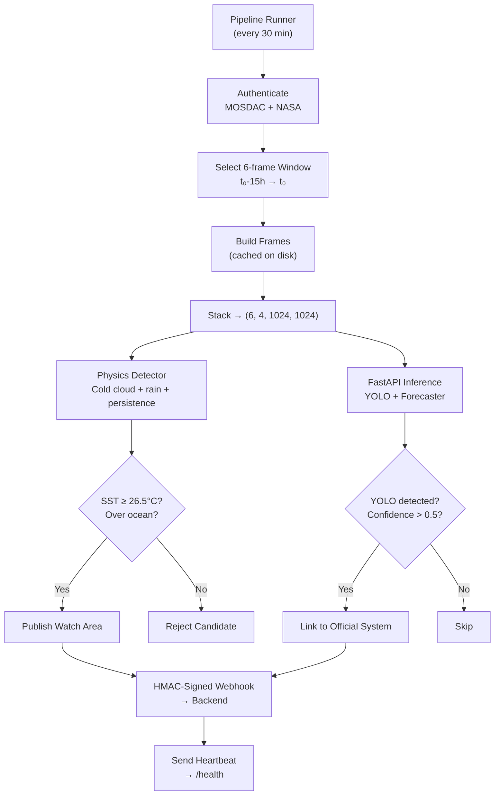

#### Data Sources

| Source | Agency | Data Product | Cadence | Channels |
|--------|--------|-------------|---------|----------|
| **INSAT-3DS** | ISRO MOSDAC | L1C ASIA_MER (HDF5) | 30 min | TIR1, TIR2, WV |
| **GPM IMERG** | NASA GES DISC | Early Run half-hourly (HDF5) | 30 min (~4 h latency) | Precipitation Rate |
| **JTWC** | US DoD | io* .tcw warnings | ~6h | Position, intensity |
| **IBTrACS** | NOAA NCEI | ACTIVE + NI archive (CSV) | ~6h | Best-track points |
| **Open-Meteo / NASA GIBS** | open services | wind, SST, weather; map tiles | hourly / daily | map + point weather |
| **GeoNames** | GeoNames (CC-BY) | towns ≥ 1,000 people | static | population exposure |

---

### Phase 2: Computer Vision — YOLO-OBB Cyclone Detection

> **Directory**: `vision/`

#### 4-Channel Weight Surgery

Standard YOLO models expect 3-channel RGB input. CYCLO-NEXUS requires **4-channel multi-spectral** input. The `YOLO4ChannelSurgery` module performs deterministic weight transplantation:

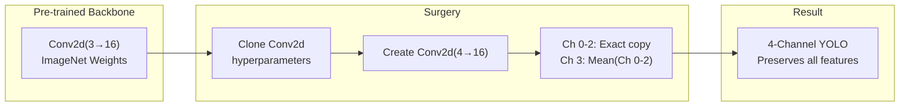

#### OBB Annotation Format

```
class_id  x_center  y_center  width  height  θ
   │         │         │        │       │     │
   │         │         │        │       │     └── Spiral-band tilt (radians)
   │         │         │        │       └──────── CDO height (normalized)
   │         │         │        └──────────────── CDO width (normalized)
   │         │         └───────────────────────── Pixel y (normalized)
   │         └─────────────────────────────────── Pixel x (normalized)
   └───────────────────────────────────────────── IMD class [0-6]
```

#### Physics-Aware Augmentation

**Critical constraint:** Horizontal flips are **strictly forbidden** because they would invert the cyclone's rotation from CCW (physically correct for Northern Hemisphere) to CW, producing physically impossible training samples.

Only rotation augmentation in [-180°, +180°] is permitted, with synchronized tensor-label coordinate transforms.

---

### Phase 3: Trajectory Forecasting — ConvLSTM + Bi-GRU

> **Directory**: `forecaster/`

#### Neural Network Architecture

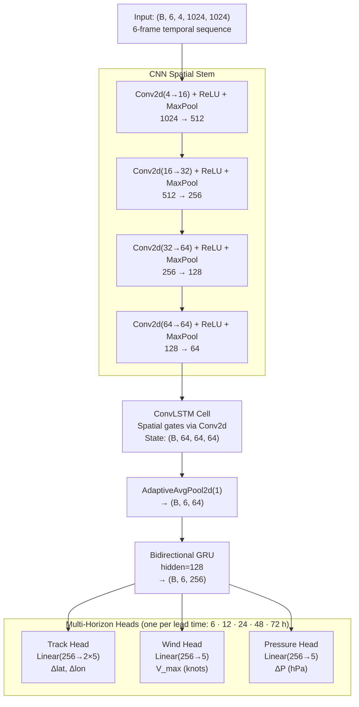

#### Why the CNN Stem is Critical

Without spatial downsampling, maintaining ConvLSTM hidden states at full resolution would require:
```
4 × 64 × 1024 × 1024 × 4 bytes ≈ 1 GB per hidden state tensor
```
The four-layer CNN stem reduces the spatial footprint from **1024×1024 → 64×64** (a **256× area reduction**) before entering the recurrent loop, making the model trainable on consumer GPUs.

#### Forecast Horizons

| Horizon | Lead Time | Primary Use |
|---------|----------|-------------|
| H₁ | +6 hours | Immediate tactical decisions |
| H₂ | +12 hours | Evacuation planning |
| H₃ | +24 hours | Resource pre-positioning |
| H₄ | +48 hours | Strategic preparedness |
| H₅ | +72 hours | Long-range awareness |

---

### Phase 4: Backend API Gateway

> **Directory**: `backend/`

#### Express.js Security Middleware Stack

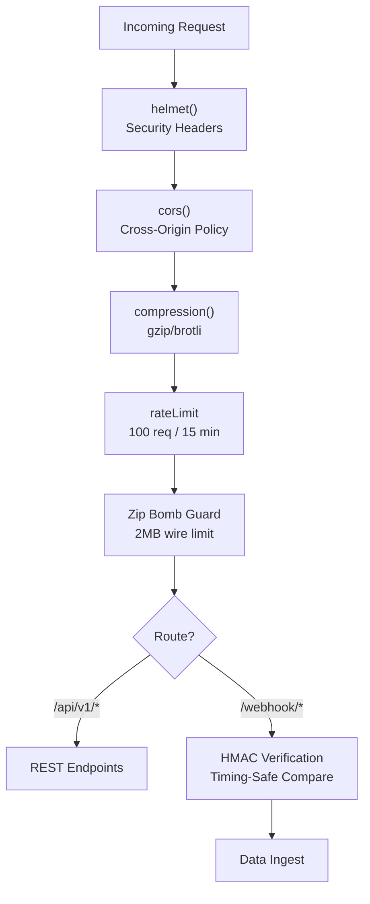

#### HMAC Webhook Security

Every webhook payload is authenticated using:
- **HMAC-SHA256** signature over `<timestamp>.<body>` (replay protection)
- Raw body buffer interception (computed before JSON parsing)
- `crypto.timingSafeEqual` prevents timing-based signature enumeration attacks

#### Database Schema (MySQL)

```sql
-- Core tables (additive migrations only)
cyclones         → id, name, lat, lon, wind, category, source, status
forecasts        → cyclone_id, forecast_hour, predicted_lat/lon/wind/pressure
advisories       → cyclone_id, language, alert_level, directives
pipeline_status  → component, status, last_success, last_data_time
besttrack_points → IBTrACS NI historical data (1980–present)
```

---

### Phase 5: Frontend PWA — Public Safety Interface

> **Directory**: `frontend/`

#### Application Architecture

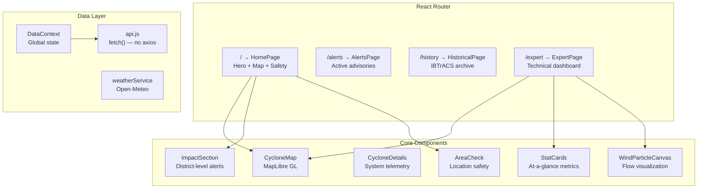

#### Key Design Decisions

| Decision | Rationale |
|----------|-----------|
| **MapLibre GL** (not Google Maps or Leaflet) | Open-source, no API key, WebGL rendering |
| **CartoDB Dark Matter** tiles | Free, professional command-center aesthetic |
| **Native `fetch()`** (no axios) | Minimal bundle for degraded network conditions |
| **Lucide React** icons | Tree-shakeable, lightweight SVG icons |
| **CSS custom properties** | Theming without build-time CSS framework |

---

## 🏷️ IMD 7-Tier Classification Scale

| Class | Category | Wind Speed (km/h) | Alert Level | Action |
|-------|----------|-------------------|-------------|--------|
| **D** | Depression | 31–49 | 🟡 Yellow | Advisory for fishermen |
| **DD** | Deep Depression | 50–61 | 🟡 Yellow | Advisory for fishermen |
| **CS** | Cyclonic Storm | 62–88 | 🟠 Orange | Halt maritime operations |
| **SCS** | Severe Cyclonic Storm | 89–117 | 🟠 Orange | Halt maritime operations |
| **VSCS** | Very Severe Cyclonic Storm | 118–166 | 🔴 Red | Mandatory evacuation |
| **ESCS** | Extremely Severe Cyclonic Storm | 167–221 | 🔴 Red | Mandatory evacuation |
| **SuCS** | Super Cyclonic Storm | ≥222 | 🔴 Red | Mandatory evacuation |

---

## 🧪 Physics-Informed AI

### Atkinson-Holliday Wind-Pressure Relationship

CYCLO-NEXUS embeds the empirical **Atkinson-Holliday** wind-pressure relationship directly into the neural network's loss function:

```
ΔP = P_env − P_center = 0.018 × V_max^1.5  (V_max in knots)
```

This physics constraint serves dual purposes:
1. **Training regularization**: Penalizes forecasts where predicted wind and pressure are physically inconsistent (tolerance: ±5 hPa)
2. **Runtime validation**: The Pydantic `AtkinsonHollidayConstraint` validator rejects any telemetry payload that violates this relationship

### Physics-Based Satellite Detector

The physics detector operates independently of YOLO and uses first-principles atmospheric science:

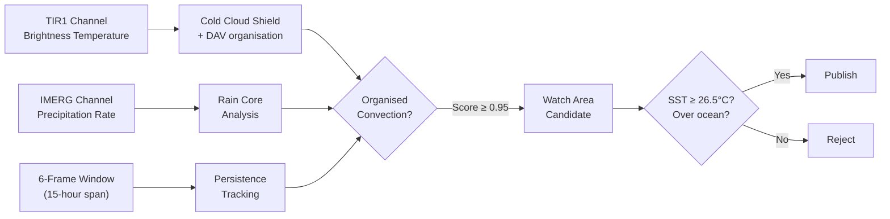

---

## 🔍 Explainability — Grad-CAM

CYCLO-NEXUS implements **Gradient-weighted Class Activation Mapping (Grad-CAM)** using only native PyTorch hooks (no external XAI libraries):

```
L_gradcam = ReLU(Σ_k α_k × A_k)

where α_k = (1/Z) × Σ_{i,j} [∂score / ∂A^k_{ij}]
```

The output is a **1024×1024 heatmap** aligned with the original satellite tensor, showing exactly which regions of the satellite image the model focused on for its prediction. This provides:
- **Transparency** for meteorologists to verify AI decisions
- **Trust building** for disaster management authorities
- **Debugging** capability for model development

---

## 🗣️ Multilingual Advisory System

Advisories are generated from **deterministic templates** (not AI-generated text), ensuring:
- **Zero hallucination risk** — all numbers come directly from verified database records
- **Consistent formatting** across languages
- **Separate directives** for different audiences

### Advisory Structure

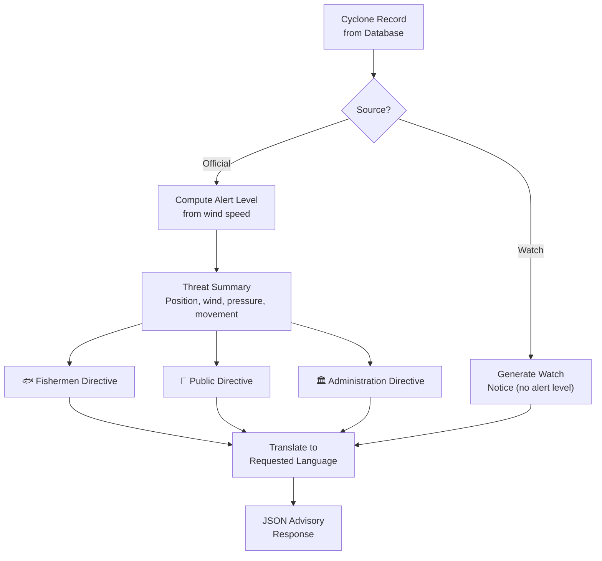

### Sample Advisory (Red Alert — Hindi)

> **अत्यंत गंभीर चक्रवाती तूफान "AMPHAN"** बंगाल की खाड़ी पर 15.2°उ, 88.4°पू के निकट स्थित है। अधिकतम निरंतर हवा लगभग 185 किमी/घंटा...
>
> **मछुआरे:** बंगाल की खाड़ी में मछली पकड़ने का कार्य पूरी तरह बंद रहेगा।  
> **जनता:** स्थानीय प्रशासन के निकासी आदेशों का तुरंत पालन करें।  
> **प्रशासन:** संवेदनशील तटीय क्षेत्रों से निकासी करें; बचाव और राहत दल पहले से तैनात करें।

---

## 📡 API Reference

### REST Endpoints

| Method | Endpoint | Description |
|--------|----------|-------------|
| `GET` | `/api/v1/cyclones` | All active cyclone systems (official + AI) |
| `GET` | `/api/v1/cyclones/:id` | One system with history and forecasts |
| `GET` | `/api/v1/cyclones/:id/forecast` | GeoJSON track + forecast (official and AI, 5 horizons) |
| `GET` | `/api/v1/cyclones/:id/advisory?lang=en\|hi` | Advisory for a specific cyclone |
| `GET` | `/api/v1/weather/wind-grid` | Cached 10 m wind field (Open-Meteo, 3°, 20–130°E × 20°S–40°N) |
| `GET` | `/api/v1/weather/place?lat&lon` | Nearest named town with distance and direction |
| `GET` | `/api/v1/historical/seasons` | Seasons with storm counts (IBTrACS NI, 1980+) |
| `GET` | `/api/v1/historical/storms?season=` · `/storms/:sid` | Storms of a season · full track of one storm |
| `GET` | `/api/v1/impact/cyclone/:id` | People/towns exposed now and along the forecast + similar past storms |
| `GET` | `/api/v1/impact/storm/:sid` | Past storm: stats, landfall, exposure, recorded losses |
| `GET` | `/api/v1/impact/major` · `/impact/near?lat&lon` · `/impact/climatology` | Major recorded cyclones · local history · climatology |
| `GET` | `/api/v1/health` | System health with per-component freshness |
| `POST` | `/api/v1/webhook/inference` | HMAC-secured satellite inference ingest |
| `POST` | `/api/v1/webhook/heartbeat` | Pipeline heartbeat (drives freshness) |
| `POST` | `/api/v1/internal/poll-telemetry` | Trigger official feed poll (CRON_SECRET) |

### Inference API (FastAPI)

| Method | Endpoint | Description |
|--------|----------|-------------|
| `POST` | `/predict` | Run YOLO-OBB + Forecaster on tensor window |
| `GET` | `/health` | Model loading status, device, memory |

---

## 🚀 Deployment Architecture

```
  Oracle Always-Free VM (Mumbai)               Hostinger                    Vercel
  ┌────────────────────────────┐    HMAC      ┌───────────────────┐  HTTPS ┌────────────┐
  │ Pipeline Runner (30 min)   │ ──────────►  │ Express API       │ ◄───── │ React PWA  │
  │   MOSDAC + NASA IMERG      │  webhooks    │ MySQL Database    │        └────────────┘
  │ Inference API (:8000)      │              │ Official Feed     │
  │   YOLO-OBB + Forecaster    │              │ Worker (JTWC)     │
  └────────────────────────────┘              └───────────────────┘
                                                     ▲
                              cron-job.org (free) ────┘ POST /poll-telemetry
```

### Why This Architecture?
- **Pipeline + Inference share one VM** — the 6-frame tensor window (~100 MB as float32) never crosses the internet
- **Indian IP** for MOSDAC data access (low latency, no geoblocking)
- **Always-Free VM** does not sleep (unlike Heroku/Render free tiers)
- **Total cost: $0/month** (Oracle free tier + Vercel free + Hostinger shared hosting)

---

## 👥 Impact & Exposure Engine

> **Files**: `backend/src/services/impact.js`, `backend/src/routes/impact.js`

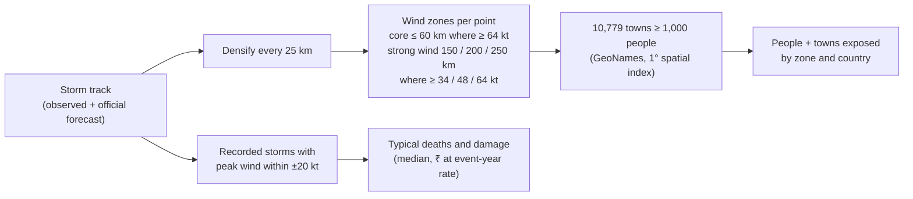

| Example | Result |
|---|---|
| Cyclone **Amphan** (2020) | 5.6 crore people in strong-wind zone, 1.4 crore in core; 128 deaths; ₹1.02 lakh crore damage |
| **Puri** — local history | 65 systems within 150 km since 1980, 13 of them cyclones; strongest: 1999 Super Cyclone |
| **11 major recorded cyclones** (1999–2021) | ~1.5 lakh lives lost, ~₹3.38 lakh crore damage |

Exposure is a **lower bound** (villages under 1,000 people are not listed) and zones use typical radii, not measured wind fields — both are stated on screen. Recorded losses are approximate published figures with a source link per storm.

---

## 🔐 Security Flow

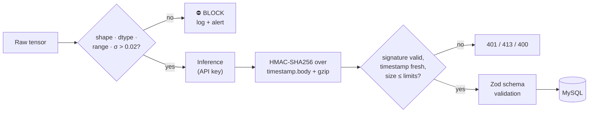

---

## 🧪 Testing & Validation

### Test Suite Coverage

| Suite | Command | Result |
|---|---|---|
| Python — pipeline, vision, forecaster, physics loss, Grad-CAM | `python -m pytest -q` | **115 passed** |
| Backend — official-feed parser, advisories, impact engine | `cd backend && npm test` | **21 passed** |
| End-to-end transport + security (signature, replay rejection, 413, zip-bomb) | `python verify_phase1_e2e.py` | **all checks pass** |
| Frontend | `cd frontend && npm run build` | builds cleanly |

### Real-World Validation

The physics detector was scored on **20 real INSAT-3DS + IMERG cases (2024–2025)** — 14 IBTrACS storms and 6 storm-free days ([`docs/validation_report.md`](docs/validation_report.md)):

| Watch threshold | Storms detected | False-alarm days |
|---|---|---|
| 0.60 | 10 / 14 (71 %) | 4 / 6 |
| 0.90 | 9 / 14 (64 %) | 2 / 6 |
| **0.95 (chosen)** | **8 / 14 (57 %)** | **0 / 6** |

- Position error of hits: 101–463 km (median ≈ 330 km) — infrared finds the cold cloud centre, so **official positions always take priority**
- Replaying Cyclone Remal (26 May 2024) through the live pipeline flags it with score 1.00
- Live end-to-end pipeline verified with real INSAT-3DS and IMERG data
- uint8 tensor transport reduced payload from **83 MB → 15.3 MB** (81% reduction)

---

## ⚖️ Limitations — Stated Honestly

- The YOLO-OBB and forecaster weights shipped today were trained on synthetic data. The real-data toolkit (`data_pipeline/training/`, `vision/train_real_obb.py`, `forecaster/train_multi_horizon.py`) is complete; until retrained models beat persistence on the validation set, **the AI forecast stays switched off in production** (`AI_FORECAST_ENABLED=false`).
- The physics detector finds organised cold cloud 100–460 km from the circulation centre; it produces *watch areas* and never overrides official positions.
- Validation covers 20 cases; more storm-free days are needed to pin down the false-alarm rate.
- Population exposure is a lower bound and uses typical wind radii.
- Cyclo-Nexus **does not replace official warnings** — IMD is the authority for India.

---

## 🗺️ Roadmap

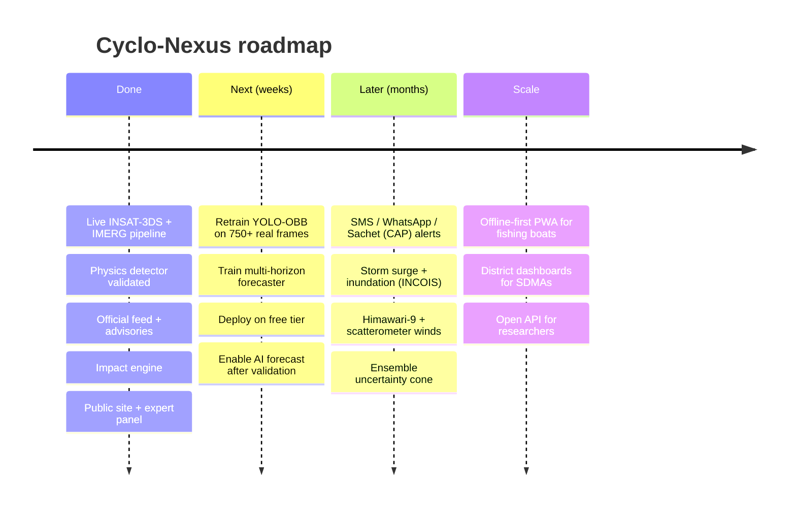

---

## 📁 Project Structure

```
cyclo-nexus/
├── backend/                    # Express.js API Gateway (Node.js)
│   ├── src/
│   │   ├── server.js           # Main server with middleware stack
│   │   ├── routes/             # REST API endpoints
│   │   │   ├── cyclones.js     # Active cyclone data
│   │   │   ├── advisory.js     # Multilingual advisory generation
│   │   │   ├── webhook.js      # HMAC-secured inference ingest
│   │   │   ├── health.js       # Component freshness monitoring
│   │   │   ├── historical.js   # IBTrACS NI archive (1980+)
│   │   │   ├── weather.js      # Wind grid cache
│   │   │   └── impact.js       # Exposure, recorded losses, local history, climatology
│   │   ├── services/           # Business logic
│   │   │   ├── advisory_generator.js  # Template-based advisory engine
│   │   │   ├── cyclone_store.js       # Cyclone CRUD + multi-source merge
│   │   │   ├── geojson_serializer.js  # RFC 7946 GeoJSON builder
│   │   │   └── impact.js             # Population exposure + analog engine
│   │   ├── middleware/         # Security & performance middleware
│   │   ├── workers/            # Background data workers
│   │   │   ├── ingest_worker.js    # JTWC/IBTrACS official feed
│   │   │   └── wind_grid.js        # Open-Meteo wind cache
│   │   └── db/                 # Database migrations & connections
│   └── package.json
│
├── frontend/                   # React PWA (Vite)
│   ├── src/
│   │   ├── App.jsx             # Router with 4 pages
│   │   ├── pages/              # Page components
│   │   │   ├── HomePage.jsx    # Public safety landing page
│   │   │   ├── ExpertPage.jsx  # Technical analysis dashboard
│   │   │   ├── HistoricalPage.jsx  # IBTrACS archive explorer
│   │   │   └── AlertsPage.jsx # Active alert aggregation
│   │   ├── components/         # Reusable UI components
│   │   │   ├── CycloneMap.jsx  # MapLibre GL interactive map
│   │   │   ├── WindParticleCanvas.jsx  # Wind flow visualization
│   │   │   └── WeatherInspector.jsx    # Pinpoint conditions
│   │   ├── context/            # React context (global state)
│   │   ├── i18n/               # Internationalization (9 languages; advisories en/hi)
│   │   ├── services/           # API & weather service clients
│   │   ├── types/              # TypeScript type definitions
│   │   └── utils/              # Formatters, helpers
│   ├── index.html
│   └── vite.config.js
│
├── data_pipeline/              # Python data engineering
│   ├── ingestion/              # Satellite data workers
│   │   ├── live_pipeline_runner.py  # Main orchestrator
│   │   ├── mosdac_worker.py    # ISRO MOSDAC INSAT-3DS ingestion
│   │   ├── nasa_gpm_worker.py  # NASA GPM IMERG ingestion
│   │   └── historical_spooler.py  # Archive replay
│   ├── preprocessing/          # Data transformation
│   │   ├── tensor_assembler.py     # 4-channel tensor construction
│   │   ├── physics_detector.py     # DAV-based cyclone detection
│   │   ├── axis_regridder.py       # Coordinate system transforms
│   │   └── radiometric_calibration.py
│   ├── training/               # ML dataset builders
│   ├── validation/             # Real-case evaluation suite
│   ├── catalog/                # IBTrACS data harmonization
│   └── requirements.txt
│
├── vision/                     # Computer vision module
│   ├── model/                  # YOLO-OBB architecture
│   │   ├── yolo_obb_4ch.py     # 4-channel weight surgery
│   │   ├── imd_classification_head.py  # IMD 7-tier classifier
│   │   └── eye_diameter_estimator.py   # Physical eye metrics
│   ├── annotation/             # OBB label generation
│   ├── augmentation/           # Physics-aware augmentation
│   ├── preprocessing/          # Vision-specific transforms
│   └── requirements.txt
│
├── forecaster/                 # Trajectory forecasting module
│   ├── model/                  # ConvLSTM + Bi-GRU architecture
│   │   ├── spatiotemporal_forecaster.py  # Main model
│   │   ├── conv_lstm.py        # ConvLSTM cell implementation
│   │   └── bi_gru_decoder.py   # Bidirectional GRU decoder
│   ├── physics/                # Physics-informed loss
│   │   ├── atkinson_holliday_loss.py   # Wind-pressure constraint
│   │   └── composite_loss.py   # Multi-horizon weighted loss
│   ├── xai/                    # Explainability
│   │   ├── gradcam_generator.py    # Grad-CAM implementation
│   │   └── heatmap_overlay.py      # Visualization utilities
│   ├── data/                   # Temporal matrix construction
│   ├── sequence/               # Sequence validation
│   └── requirements.txt
│
├── inference/                  # FastAPI model serving
│   ├── serve.py                # Prediction API with memory guard
│   ├── schemas.py              # Request/response models
│   ├── Dockerfile              # CPU-optimized container
│   └── requirements.txt
│
├── schemas/                    # Cross-service contracts
│   ├── telemetry_contract.py   # Pydantic master schema
│   ├── imd_scale.py            # IMD classification logic
│   ├── geojson_spec.json       # GeoJSON payload schema
│   └── api_webhook_contract.md # Webhook API documentation
│
├── colab_notebooks/            # Google Colab training notebooks
│   ├── 01_data_preparation.ipynb
│   ├── 02_yolo_obb_training.ipynb
│   └── 03_spatiotemporal_training.ipynb
│
├── fixtures/                   # Test data & mock payloads
├── verify_phase1_e2e.py        # End-to-end transport / security test
├── deploy/                     # Deployment configuration
│   └── oracle/                 # Oracle Cloud VM setup
│       ├── setup.sh
│       └── *.service           # systemd unit files
│
├── docs/                       # Documentation
│   ├── architecture.md
│   ├── api_reference.md
│   ├── deployment_guide.md
│   ├── colab_training_guide.md
│   └── validation_report.md
│
└── tests/                      # Test suites
    ├── data_pipeline/
    ├── vision/
    └── forecaster/
```

---

## 🚀 Getting Started

### Prerequisites

- **Python 3.10+** with pip
- **Node.js 18+** with npm
- **MySQL/MariaDB** (local or hosted)
- **MOSDAC account** (for satellite data access)
- **NASA Earthdata account** (for IMERG data)

### Local Development Setup

```bash
# 1. Clone the repository
git clone https://github.com/itstaruns27/cyclo-nexus.git
cd cyclo-nexus

# 2. Backend setup
cd backend
cp .env.example .env          # Configure DB credentials & secrets
npm install
npm run migrate               # Create database tables
node scripts/import_ibtracs.js # Load IBTrACS NI best tracks (history + impact)
npm run dev                   # Start API on :3001

# 3. Frontend setup (new terminal)
cd frontend
npm install
npm run dev                   # Start Vite dev server on :5173

# 4. Python environment (new terminal)
python -m venv .venv
.venv/Scripts/activate        # Windows
pip install -r data_pipeline/requirements.txt
pip install -r forecaster/requirements.txt

# 5. Inference server
pip install -r inference/requirements.txt
python -m uvicorn inference.serve:app --port 8000

# 6. Run one pipeline cycle
python -m data_pipeline.ingestion.live_pipeline_runner --dry-run
#    replay a past storm without publishing:
python -m data_pipeline.ingestion.live_pipeline_runner --at 2024-05-26T09:00Z --dry-run
```

**Demo mode (for presentations):** `cd backend && npm run demo:start` inserts a clearly labelled scripted cyclone ("ARNAB") so every page can be shown working; `npm run demo:stop` removes it.

### Environment Variables

| Variable | Service | Description |
|----------|---------|-------------|
| `DB_HOST`, `DB_PORT`, `DB_USER`, `DB_PASSWORD`, `DB_NAME` | Backend | MySQL connection |
| `CORS_ORIGIN` | Backend | Allowed web origins (comma-separated) |
| `WEBHOOK_SECRET` | Backend + Pipeline | HMAC signing key (≥32 chars) |
| `CRON_SECRET` | Backend | Official feed poll authentication |
| `MOSDAC_USER`, `MOSDAC_PASS` | Pipeline | ISRO MOSDAC credentials |
| `NASA_EARTHDATA_USER`, `NASA_EARTHDATA_PASS` | Pipeline | NASA data access |
| `VITE_API_BASE_URL` | Frontend | Backend API URL |
| `INFERENCE_API_KEY` | Inference + Pipeline | API key for the inference service |
| `BACKEND_API_URL`, `INFERENCE_URL` | Pipeline | Where to publish / infer |
| `WATCH_MIN_SCORE` (0.95), `AI_FORECAST_ENABLED` (false), `TENSOR_TRANSPORT` (uint8) | Pipeline | Validated detector threshold and safety switches |

---

## 🌍 Real-World Impact

### Lives Saved Through Early Warning

- **24 hours of warning can cut damage by ~30%** (Global Commission on Adaptation, 2019)
- Cyclo-Nexus refreshes satellite analysis every **30 minutes** and shows official forecast tracks out to **72 hours**, with **people-in-path** estimates for evacuation planning
- Multilingual advisories reach populations that current English-only systems miss

### Who Benefits

| Stakeholder | Benefit |
|------------|---------|
| **Coastal communities** | Timely, localized, multilingual warnings |
| **Fishermen** | Sea-state awareness before venturing out |
| **Disaster management authorities** | Centralized intelligence for evacuation planning |
| **Meteorologists** | AI-augmented analysis with XAI explanations |
| **Researchers** | Historical cyclone archive + standardized data pipeline |

### Alignment with National Initiatives

- **NDMA Guidelines** on cyclone preparedness
- **IMD's classification system** (7-tier intensity scale)
- **Digital India** — accessible, multilingual public services
- **ISRO's open data** policy (MOSDAC)
- **UN Sendai Framework** for Disaster Risk Reduction (2015–2030)

---

## 👥 Team

**Team Tikka Techies** (Team ID: 136905) — Smart India Hackathon 2026

| | Details |
|---|---|
| **Problem Statement** | SIH26070 — AI/ML based system for identification, classification and prediction of tropical cyclone patterns using multi-source satellite data |
| **Theme** | Disaster Management |
| **Category** | Software |

---

## 📚 References

1. Shi, X. et al. (2015). *Convolutional LSTM Network: A Machine Learning Approach for Precipitation Nowcasting.* NeurIPS. [arXiv:1506.04214](https://arxiv.org/abs/1506.04214)
2. Piñeros, M. F., Ritchie, E. A., Tyo, J. S. (2008). *Objective measures of tropical cyclone structure and intensity change from remotely sensed infrared image data.* IEEE TGRS. [doi:10.1109/TGRS.2008.2000819](https://doi.org/10.1109/TGRS.2008.2000819)
3. Dvorak, V. F. (1975). *Tropical cyclone intensity analysis and forecasting from satellite imagery.* Monthly Weather Review. [doi:10.1175/1520-0493(1975)103<0420:TCIAAF>2.0.CO;2](https://doi.org/10.1175/1520-0493(1975)103%3C0420:TCIAAF%3E2.0.CO;2)
4. Atkinson, G. D., Holliday, C. R. (1977). *Tropical cyclone minimum sea level pressure / maximum sustained wind relationship for the western North Pacific.* Monthly Weather Review. [doi:10.1175/1520-0493(1977)105<0421:TCMSLP>2.0.CO;2](https://doi.org/10.1175/1520-0493(1977)105%3C0421:TCMSLP%3E2.0.CO;2)
5. Knapp, K. R. et al. (2010). *The International Best Track Archive for Climate Stewardship (IBTrACS).* Bull. Amer. Meteor. Soc. [doi:10.1175/2009BAMS2755.1](https://doi.org/10.1175/2009BAMS2755.1)
6. Mohapatra, M., Sharma, M. *Cyclone warning services in India during recent years: a review.* MAUSAM 70(4). [doi:10.54302/mausam.v70i4.204](https://doi.org/10.54302/mausam.v70i4.204)
7. Data: [ISRO MOSDAC](https://www.mosdac.gov.in/) · [NASA GPM IMERG](https://gpm.nasa.gov/data/imerg) · [NOAA IBTrACS](https://www.ncei.noaa.gov/products/international-best-track-archive) · [JTWC](https://www.metoc.navy.mil/jtwc/jtwc.html) · [Open-Meteo](https://open-meteo.com/) · [NASA GIBS](https://nasa-gibs.github.io/gibs-api-docs/) · [GeoNames](https://www.geonames.org/)
8. Authorities: [IMD](https://mausam.imd.gov.in/) · [NDMA — Cyclone](https://ndma.gov.in/Natural-Hazards/Cyclone)
9. Impact evidence: [MoPSW coastline 2025](https://shipmin.gov.in/en/content/revised-length-indias-coastline-0) · [CMFRI census 2016](http://eprints.cmfri.org.in/17490/) · [WMO / GCA 2019](https://wmo.int/news/media-centre/early-warning-systems-must-protect-everyone-within-five-years) · [World Bank — Phailin](https://www.worldbank.org/en/results/2014/04/10/india-averts-cyclone-phailin-devastation) · [Amphan losses, WMO 2020](https://theprint.in/india/amphan-costliest-cyclone-in-north-indian-ocean-resulted-in-loss-of-14-billion-un-report/642754/)
10. Tools: [Ultralytics YOLO OBB](https://docs.ultralytics.com/tasks/obb/) · [MapLibre GL JS](https://maplibre.org/)

---

<p align="center">
  <b>Built with ❤️ for the safety of coastal communities across the North Indian Ocean</b>
</p>
<p align="center">
  <i>Cyclo-Nexus — Where AI meets atmospheric science to save lives</i><br/>
  <sub>⚠️ A hackathon project. It does not replace official warnings — always follow the India Meteorological Department.</sub>
</p>
