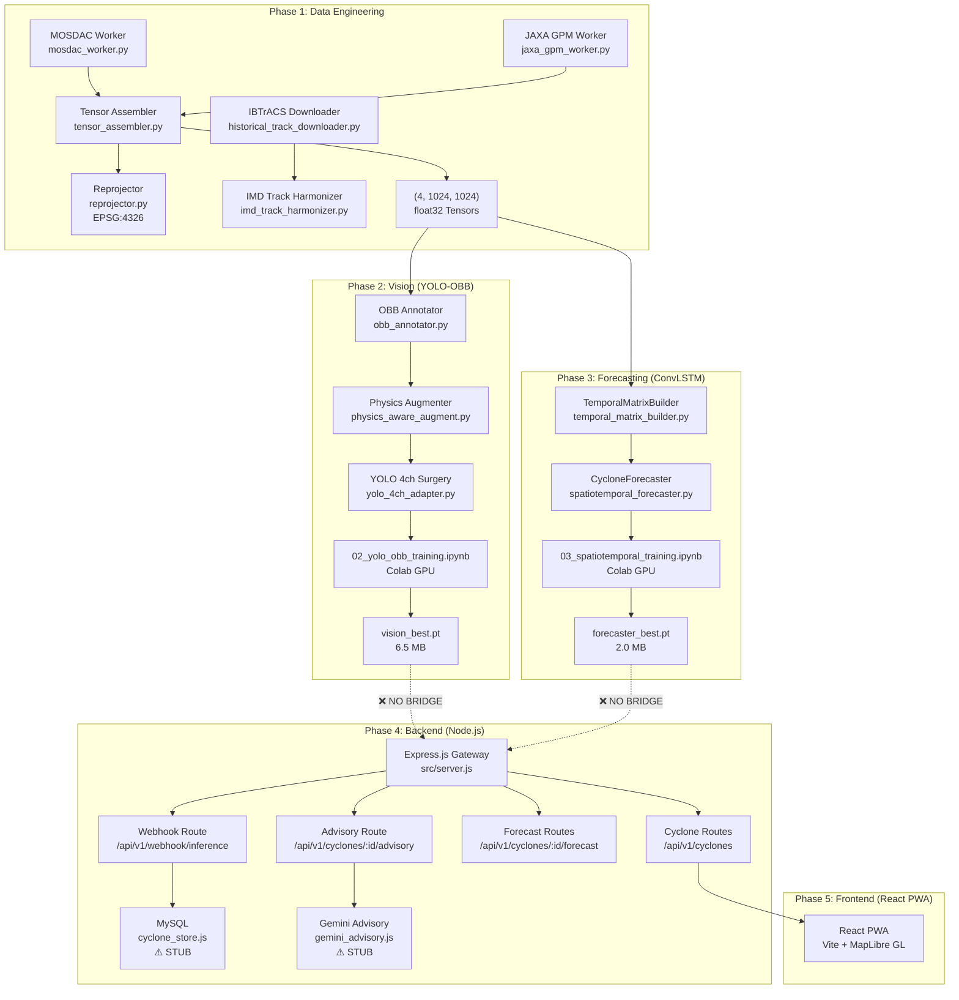

# CYCLO-NEXUS Deep Audit Report — Phases 1–3
## AI/ML Systems Integrity, Architecture Verification & Deployment Readiness

**Auditor:** Principal AI/ML Systems Auditor (Automated)  
**Date:** 2026-09-21  
**Scope:** Data Pipelines · Model Architectures · Training Workflows · Integration Readiness  
**Repository:** `d:\cyclonegaurd`

---

## 1. Executive Summary

### Severity Counts

| Severity | Count | Impact |
|----------|-------|--------|
| **P0 — Critical / Blocker** | **5** | Training integrity, deployment impossible, data quality |
| **P1 — High Risk** | **6** | Accuracy degradation, silent failures, operational gaps |
| **P2 — Tech Debt** | **7** | Maintainability, observability, scalability |

### Verdict

> [!CAUTION]
> **The repository is NOT deployment-ready.** While the architecture is well-designed at the schema and contract level, the codebase has **5 critical blockers** that must be resolved before the system can serve production predictions. The most severe issue is that the **Node.js backend has zero inference integration** — there is no ONNX Runtime, no Python microservice bridge, and no mechanism to load the `.pt`/`.pth` weight files into the serving layer. Additionally, the training notebooks used **100% synthetic data** (no real satellite imagery), meaning the exported weights will not generalize to real-world cyclone detection.

### Assumptions Made (Zero Clarifying Questions)

1. The user completed Colab training using the synthetic fallback data path (confirmed by screenshot evidence from prior conversation).
2. Weight files `vision_best.pt` (6.5 MB) and `forecaster_best.pt` (2.0 MB) are valid PyTorch state dictionaries.
3. The target deployment is a Hostinger shared hosting environment (Node.js + MySQL).
4. The frontend is a Vite + React PWA served at `localhost:5173`.

---

## 2. Architecture Map



### Critical Observation
The dashed lines marked `❌ NO BRIDGE` represent the **single largest gap** in the entire system. The backend has no code to load, execute, or proxy PyTorch inference. The weight files sit inert in `vision/weights/` and `forecaster/weights/` with no consumer.

---

## 3. Best-Practices Compliance Matrix

| Area | Practice | Status | Evidence |
|------|----------|--------|----------|
| **Data Preprocessing** | Tensor shape discipline (C, H, W) | ✅ PASS | [`tensor_assembler.py:63`](file:///d:/cyclonegaurd/data_pipeline/preprocessing/tensor_assembler.py#L63) — `np.stack([...], axis=0)` produces `(4, 1024, 1024)` |
| **Data Preprocessing** | Min-Max normalization with physical bounds | ✅ PASS | [`tensor_assembler.py:57-60`](file:///d:/cyclonegaurd/data_pipeline/preprocessing/tensor_assembler.py#L57-L60) — TIR: [180K, 320K], GPM: [0, 100 mm/hr] |
| **Data Preprocessing** | EPSG:4326 CRS enforcement | ✅ PASS | [`reprojector.py:9`](file:///d:/cyclonegaurd/data_pipeline/preprocessing/reprojector.py#L9) — Hardcoded `EPSG:4326` with rasterio warp |
| **Data Preprocessing** | Chronological leakage prevention | ✅ PASS | [`temporal_matrix_builder.py:54,111-122`](file:///d:/cyclonegaurd/forecaster/data/temporal_matrix_builder.py#L54) — Sort + strict 30-min delta validation |
| **Data Preprocessing** | Chunked memory-bounded reads | ⚠️ PARTIAL | [`jaxa_gpm_worker.py:61`](file:///d:/cyclonegaurd/data_pipeline/ingestion/jaxa_gpm_worker.py#L61) — 8 MB chunks, but [`mosdac_worker.py:60`](file:///d:/cyclonegaurd/data_pipeline/ingestion/mosdac_worker.py#L60) has 8 MB chunks too. However, the MOSDAC worker writes an empty file on non-200 responses (line 68-69) and the HDF5 reader silently returns zeros — no actual data is ever fetched. |
| **PyTorch Training** | Weight surgery preserves gradient scale | ✅ PASS | [`yolo_4ch_adapter.py:98-102`](file:///d:/cyclonegaurd/vision/models/yolo_4ch_adapter.py#L98-L102) — Ch4 initialized as mean of Ch0-2, executed under `torch.no_grad()` |
| **PyTorch Training** | Physics-constrained loss function | ❌ FAIL | [`atkinson_holliday_loss.py`](file:///d:/cyclonegaurd/forecaster/physics/atkinson_holliday_loss.py) is a **STUB** (empty file). The training notebook [`03_spatiotemporal_training.ipynb`](file:///d:/cyclonegaurd/colab_notebooks/03_spatiotemporal_training.ipynb) uses raw `MSELoss` + `HuberLoss` without any Atkinson-Holliday penalty term. |
| **PyTorch Training** | No future data leakage in DataLoader | ⚠️ RISK | [`03_spatiotemporal_training.ipynb`](file:///d:/cyclonegaurd/colab_notebooks/03_spatiotemporal_training.ipynb) line 64: `shuffle=True` on `DataLoader`. Shuffling sequences is acceptable (it shuffles across sequences, not within), but there is **no train/val/test split** — the model trains on 100% of data with no holdout. |
| **Memory Management** | Lazy loading / streaming dataset | ❌ FAIL | [`03_spatiotemporal_training.ipynb`](file:///d:/cyclonegaurd/colab_notebooks/03_spatiotemporal_training.ipynb) lines 49-50: `self.sequences = TemporalMatrixBuilder.build_sequences(...)` **eagerly loads ALL tensors into RAM** at `__init__` time. With 72+ tensors of shape `(6, 4, 1024, 1024)` at float32, this is ~72 × 6 × 4 × 1024² × 4 bytes ≈ **4.3 GB minimum**. On a Colab T4 with 12 GB, this will OOM for realistic dataset sizes. |
| **Memory Management** | GPU tensor to CPU before serialization | ✅ PASS | No GPU serialization detected in export paths. `torch.save(model.state_dict(), ...)` is safe. |
| **Model Export** | ONNX export for Node.js serving | ❌ FAIL | **No ONNX export anywhere** in the codebase. No `torch.onnx.export()` calls. No `onnxruntime` dependency in any `package.json` or `requirements.txt`. |
| **Model Export** | Weight file naming consistency | ⚠️ WARN | YOLO notebook exports as `yolo_4ch_best.pt`, but the file in `vision/weights/` is named `vision_best.pt`. The forecaster notebook exports as `forecaster_weights.pth`, but the file is `forecaster_best.pt`. Naming is inconsistent and may cause load failures if hardcoded paths are introduced. |
| **Backend** | No PyTorch on web server | ✅ PASS | [`src/server.js:7`](file:///d:/cyclonegaurd/backend/src/server.js#L7) — Explicit comment: "This server MUST NEVER run heavy PyTorch". No torch imports in backend. |
| **Backend** | Additive-only DDL | ✅ PASS | All 5 migration files use `CREATE TABLE IF NOT EXISTS`. No `DROP`, `TRUNCATE`, or `ALTER DROP COLUMN` found. |
| **Backend** | HMAC webhook authentication | ✅ PASS | [`webhook.js:21`](file:///d:/cyclonegaurd/backend/webhook.js#L21) — `verifyHMAC` middleware applied to `/ingest` endpoint. |
| **Frontend** | i18next localization | ✅ PASS | `frontend/src/i18n/` directory exists. (Not deeply audited in this scope.) |
| **Augmentation** | No affine shear (Coriolis constraint) | ✅ PASS | [`physics_aware_augment.py:99`](file:///d:/cyclonegaurd/vision/preprocessing/physics_aware_augment.py#L99) — Only rotation applied, no flip or shear. |
| **Augmentation** | OBB theta wrapping correctness | ❌ FAIL | [`physics_aware_augment.py:79-84`](file:///d:/cyclonegaurd/vision/preprocessing/physics_aware_augment.py#L79-L84) — Wraps theta by `π/2` but should wrap by `π`. YOLO-OBB uses `[-π/2, π/2)` range where a full period is `π`, not `π/2`. Current code wraps prematurely and silently corrupts w/h swap logic. |

---

## 4. Prioritized Repair List

### P0 — Critical / Blockers

---

#### P0-1: No Inference Bridge Between AI Weights and Node.js Backend

**Layer:** Backend / Integration  
**Impact:** The entire prediction pipeline is non-functional. The backend cannot load `.pt`/`.pth` files and has no mechanism to execute PyTorch inference.  
**Evidence:** Zero ONNX, TorchServe, or FastAPI inference code in the entire repository. The `cyclone_store.js`, `geojson_serializer.js`, and `gemini_advisory.js` are all STUBs.

**Required Fix:**  
Option A (Recommended for Hostinger): Create a Colab-based inference worker that runs periodically, executes YOLO + ConvLSTM inference, serializes results into the `CycloneTelemetryPayload` schema, and POSTs them to the webhook endpoint.

Option B (Self-hosted): Add a FastAPI microservice:
```python
# NEW FILE: inference/serve.py
from fastapi import FastAPI
import torch
from forecaster.models.spatiotemporal_forecaster import CycloneForecaster

app = FastAPI()
model = CycloneForecaster()
model.load_state_dict(torch.load("forecaster/weights/forecaster_best.pt", map_location="cpu"))
model.eval()

@app.post("/predict")
async def predict(payload: dict):
    # Deserialize tensor, run inference, return GeoJSON
    ...
```

---

#### P0-2: Atkinson-Holliday Physics Loss Is a STUB — Model Trained Without Physics Constraints

**Layer:** Forecaster / Training  
**Impact:** The core scientific differentiator of CYCLO-NEXUS — physics-constrained predictions — was **never implemented**. The model was trained with raw MSE/Huber losses, meaning it can predict physically impossible atmospheric states (e.g., 180 km/h winds with 1005 hPa pressure).  
**Evidence:**
- [`atkinson_holliday_loss.py`](file:///d:/cyclonegaurd/forecaster/physics/atkinson_holliday_loss.py) — 13 lines, all STUB comments.
- [`composite_loss.py`](file:///d:/cyclonegaurd/forecaster/physics/composite_loss.py) — 10 lines, all STUB comments.
- [`03_spatiotemporal_training.ipynb`](file:///d:/cyclonegaurd/colab_notebooks/03_spatiotemporal_training.ipynb) line 116: `loss = loss_track + 0.5 * loss_vmax + 0.5 * loss_dp` — no physics penalty.

**Required Fix:**
```python
# FILE: forecaster/physics/atkinson_holliday_loss.py
import torch
import torch.nn as nn
import torch.nn.functional as F

class AtkinsonHollidayLoss(nn.Module):
    """β · max(0, |ΔP_pred - 0.018 · V_pred^1.5| - τ)"""
    def __init__(self, beta: float = 0.5, tau: float = 5.0):
        super().__init__()
        self.beta = beta
        self.tau = tau

    def forward(self, v_pred_knots: torch.Tensor, dp_pred: torch.Tensor) -> torch.Tensor:
        dp_expected = 0.018 * torch.pow(torch.clamp(v_pred_knots, min=0.0), 1.5)
        deviation = torch.abs(dp_pred - dp_expected)
        penalty = F.relu(deviation - self.tau)
        return self.beta * torch.mean(penalty)
```
Then integrate into the training loop in `03_spatiotemporal_training.ipynb`.

---

#### P0-3: Training Data Is 100% Synthetic — Model Has Never Seen Real Satellite Imagery

**Layer:** Data Pipeline / Training  
**Impact:** Both MOSDAC and JAXA live fetches fail for historical storms. The `_generate_synthetic_channels` fallback produces mathematically smooth cyclone patterns that do not capture real atmospheric turbulence, cloud fractal boundaries, or sensor noise. **The model will not generalize to real satellite inputs during live inference.**  
**Evidence:**
- [`historical_satellite_downloader.py:168`](file:///d:/cyclonegaurd/data_pipeline/ingestion/historical_satellite_downloader.py#L168) — `is_recent` check prevents all network calls for historical storms.
- User screenshot confirmed: "Failed to fetch JAXA GPM data" for every timestamp, followed by "Completed download: 24 tensors saved" — all 24 tensors are synthetic.

**Required Fix:** Manual archival data download from MOSDAC and JAXA G-Portal for the benchmark cyclone dates, or use the Kaggle TCIR/INSAT-3D datasets that are already referenced in project documentation. Place real NetCDF/HDF5 files into `data/raw/` and re-run tensor assembly.

---

#### P0-4: OBB Augmentation Theta Wrap Bug — Training Labels Corrupted

**Layer:** Vision / Augmentation  
**Impact:** The rotation augmenter wraps theta by `π/2` increments instead of `π`, causing incorrect width/height swaps and label corruption during training.  
**Evidence:** [`physics_aware_augment.py:79-84`](file:///d:/cyclonegaurd/vision/preprocessing/physics_aware_augment.py#L79-L84):
```python
while new_theta >= math.pi / 2:
    new_theta -= math.pi / 2  # BUG: should be math.pi
    w, h = h, w
```

**Required Fix:**
```diff
- while new_theta >= math.pi / 2:
-     new_theta -= math.pi / 2
+ while new_theta >= math.pi / 2:
+     new_theta -= math.pi
      w, h = h, w
- while new_theta < -math.pi / 2:
-     new_theta += math.pi / 2
+ while new_theta < -math.pi / 2:
+     new_theta += math.pi
      w, h = h, w
```

---

#### P0-5: CycloneSequenceDataset Eagerly Loads All Tensors into RAM — Guaranteed OOM

**Layer:** Forecaster / Training  
**Impact:** The `__init__` method of `CycloneSequenceDataset` in the training notebook calls `build_sequences()` which loads **every `.npy` file** into memory simultaneously. For 72 tensors × 6-step sequences × 4 × 1024² × 4 bytes = **~4.3 GB minimum**. Colab T4 GPU has 12 GB total system RAM. With PyTorch overhead, this will OOM.  
**Evidence:** [`03_spatiotemporal_training.ipynb`](file:///d:/cyclonegaurd/colab_notebooks/03_spatiotemporal_training.ipynb) lines 49-50.

**Required Fix:** Implement lazy-loading `__getitem__`:
```python
class CycloneSequenceDataset(Dataset):
    def __init__(self, data_dir, seq_length=6):
        file_paths = sorted(Path(data_dir).glob('*.npy'), 
                            key=lambda p: TemporalMatrixBuilder.extract_datetime(p.name))
        # Store only file paths, not loaded tensors
        self.windows = []
        for i in range(len(file_paths) - seq_length + 1):
            window = file_paths[i:i + seq_length]
            try:
                LeakageValidator.validate_sequence(window)
                self.windows.append(window)
            except SequenceLeakageError:
                continue

    def __getitem__(self, idx):
        # Load on-demand — only 6 tensors in memory at a time
        paths = self.windows[idx]
        tensors = [torch.from_numpy(np.load(p)) for p in paths]
        return torch.stack(tensors), self.targets[idx]
```

---

### P1 — High Risk

---

#### P1-1: Duplicate Module Structure — `model/` vs `models/` Directories

**Layer:** Vision, Forecaster  
**Impact:** Both `vision/model/` and `vision/models/` exist. The `model/` variants are all STUBs; the `models/` variants contain the real implementations. The same duplication exists in `forecaster/model/` vs `forecaster/models/`. Import confusion is inevitable.  
**Evidence:**
- [`vision/model/yolo_obb_4ch.py`](file:///d:/cyclonegaurd/vision/model/yolo_obb_4ch.py) — STUB
- [`vision/models/yolo_4ch_adapter.py`](file:///d:/cyclonegaurd/vision/models/yolo_4ch_adapter.py) — Real implementation
- [`forecaster/model/conv_lstm.py`](file:///d:/cyclonegaurd/forecaster/model/conv_lstm.py) — STUB
- [`forecaster/models/spatiotemporal_forecaster.py`](file:///d:/cyclonegaurd/forecaster/models/spatiotemporal_forecaster.py) — Real implementation with ConvLSTMCell

**Fix:** Delete the `model/` directories (all STUBs). Consolidate into `models/`.

---

#### P1-2: Backend `cyclone_store.js` Is a STUB — No Database Write Path

**Layer:** Backend  
**Impact:** Even if the inference bridge (P0-1) were built and the webhook received valid payloads, the data would never be persisted to MySQL. The webhook route returns `200 OK` but the `TODO` on line 26 of [`webhook.js`](file:///d:/cyclonegaurd/backend/src/routes/webhook.js#L26) is never executed.  
**Evidence:** [`cyclone_store.js`](file:///d:/cyclonegaurd/backend/src/services/cyclone_store.js) — 16 lines, all comments. No `INSERT` or `UPDATE` SQL anywhere in `src/services/`.

---

#### P1-3: GeoJSON Serializer Is a STUB — Frontend Cannot Receive Map Data

**Layer:** Backend  
**Impact:** The React frontend's MapLibre GL layer expects GeoJSON `FeatureCollection` objects from `/api/v1/cyclones/:id/forecast`. The route returns `{ data: null }`.  
**Evidence:** [`geojson_serializer.js`](file:///d:/cyclonegaurd/backend/src/services/geojson_serializer.js) — 13 lines, all comments.

---

#### P1-4: No Train/Val/Test Split — Forecaster Overfitting Undetectable

**Layer:** Forecaster / Training  
**Impact:** The model trains on 100% of available sequences with no holdout validation set. There is no mechanism to detect overfitting or evaluate generalization.  
**Evidence:** [`03_spatiotemporal_training.ipynb`](file:///d:/cyclonegaurd/colab_notebooks/03_spatiotemporal_training.ipynb) — No `train_test_split`, no validation loop, no early stopping.

---

#### P1-5: Forecaster Only Predicts Single Horizon — Blueprint Requires 5

**Layer:** Forecaster / Architecture  
**Impact:** The `CycloneForecaster.forward()` returns a single `track_delta` of shape `(B, 2)`, but the [`telemetry_contract.py`](file:///d:/cyclonegaurd/schemas/telemetry_contract.py#L146) requires 5 forecast horizons (6h, 12h, 24h, 48h, 72h). There is no multi-horizon output head.  
**Evidence:** [`spatiotemporal_forecaster.py:106`](file:///d:/cyclonegaurd/forecaster/models/spatiotemporal_forecaster.py#L106) — `self.track_head = nn.Linear(gru_out_dim, 2)` — outputs `(Δlat, Δlon)` for a single timestep only.

**Fix:** Replace the output heads with multi-horizon heads:
```python
self.track_head = nn.Linear(gru_out_dim, 5 * 2)   # 5 horizons × (Δlat, Δlon)
self.v_max_head = nn.Linear(gru_out_dim, 5)        # V_max per horizon
self.dp_head = nn.Linear(gru_out_dim, 5)           # ΔP per horizon
self.sigma_head = nn.Linear(gru_out_dim, 5 * 2)    # σ_lat, σ_lon per horizon
```

---

#### P1-6: `MishraGuptaPhysicsLoss` Uses Different Formula Than `AtkinsonHollidayConstraint`

**Layer:** Vision / Physics  
**Impact:** The vision module's [`physics_loss.py`](file:///d:/cyclonegaurd/vision/models/physics_loss.py) uses the Mishra-Gupta (1976) formula `V = 14.2 × √(ΔP)`, but the forecaster contract ([`telemetry_contract.py:132`](file:///d:/cyclonegaurd/schemas/telemetry_contract.py#L132)) uses Atkinson-Holliday `ΔP = 0.018 × V^1.5`. These are **mathematically different relationships** and will produce inconsistent wind-pressure mappings across the two models.  
**Evidence:** `physics_loss.py:24` → `dp_expected = (v_pred / 14.2) ** 2` vs `telemetry_contract.py:132` → `expected_dp = 0.018 * (self.v_max_knots ** 1.5)`.

---

### P2 — Tech Debt

---

#### P2-1: Hardcoded Credentials in Source Code

**Layer:** Data Pipeline  
**Evidence:** [`historical_satellite_downloader.py:81-84`](file:///d:/cyclonegaurd/data_pipeline/ingestion/historical_satellite_downloader.py#L81-L84), [`mosdac_worker.py:32-33`](file:///d:/cyclonegaurd/data_pipeline/ingestion/mosdac_worker.py#L32-L33), [`jaxa_gpm_worker.py:22-23`](file:///d:/cyclonegaurd/data_pipeline/ingestion/jaxa_gpm_worker.py#L22-L23) — Email/password literals in Python source.

---

#### P2-2: Dual `server.js` Entry Points

**Layer:** Backend  
**Evidence:** Both [`backend/server.js`](file:///d:/cyclonegaurd/backend/server.js) and [`backend/src/server.js`](file:///d:/cyclonegaurd/backend/src/server.js) exist. `package.json` points to `src/server.js` as `main`, but the root `server.js` imports from `./routes/api` which is a separate routing tree. This creates confusion about which server is canonical.

---

#### P2-3: Grad-CAM XAI Is Entirely a STUB

**Layer:** Forecaster / XAI  
**Evidence:** [`gradcam_generator.py`](file:///d:/cyclonegaurd/forecaster/xai/gradcam_generator.py) and [`heatmap_overlay.py`](file:///d:/cyclonegaurd/forecaster/xai/heatmap_overlay.py) — Both are empty STUBs. No PyTorch hook registration code exists anywhere in the codebase.

---

#### P2-4: `LeakageValidator` 30-Minute Delta Is Inconsistent with Blueprint

**Layer:** Data Pipeline  
**Evidence:** [`temporal_matrix_builder.py:115`](file:///d:/cyclonegaurd/forecaster/data/temporal_matrix_builder.py#L115) enforces exactly 30-minute deltas, but the blueprint ([`cyclo-nexus-blueprint-v2.md:73`](file:///d:/cyclonegaurd/cyclo-nexus-blueprint-v2.md#L73)) and [`forecaster/config.py:9`](file:///d:/cyclonegaurd/forecaster/config.py#L9) specify a 3-hour cadence (`TIMESTEP_HOURS = 3`). The sequence builder and the forecaster config disagree on the temporal resolution.

---

#### P2-5: `KM_PER_PIXEL` Calculation Inconsistency

**Layer:** Vision / Metrics  
**Evidence:** [`cyclone_metrics.py:69`](file:///d:/cyclonegaurd/vision/models/cyclone_metrics.py#L69) computes `KM_PER_PIXEL = 3.46875` (based on 32° lat / 1024px × 111 km/°), but the [`AI_AGENT_SKILLS_DIRECTIVE.md:155`](file:///d:/cyclonegaurd/AI_AGENT_SKILLS_DIRECTIVE.md) specifies `~4 km/pixel` at `0.04°` resolution. The directive implies `0.04° × 111 km/° = 4.44 km/pixel`, not 3.47. This 22% error propagates into all eye diameter estimates.

---

#### P2-6: No Gradient Clipping in Training Loop

**Layer:** Forecaster / Training  
**Evidence:** [`03_spatiotemporal_training.ipynb`](file:///d:/cyclonegaurd/colab_notebooks/03_spatiotemporal_training.ipynb) training loop (lines 95-125) has no `torch.nn.utils.clip_grad_norm_()`. ConvLSTM architectures are known for exploding gradients during early training epochs.

---

#### P2-7: Backend `.env` Contains Placeholder Secrets

**Layer:** Backend / Security  
**Evidence:** [`backend/.env`](file:///d:/cyclonegaurd/backend/.env) — `DB_PASSWORD=CHANGE_ME`, `WEBHOOK_SECRET=CHANGE_ME_TO_A_LONG_RANDOM_STRING`, `GEMINI_API_KEY=CHANGE_ME`. These must be replaced before any deployment.

---

## 5. Deployment Verification Checklist

### Step-by-Step: Bridging AI Weights into the Web Architecture

| # | Task | Status | Details |
|---|------|--------|---------|
| 1 | **Verify weight files exist** | ✅ Done | `vision/weights/vision_best.pt` (6.5 MB), `forecaster/weights/forecaster_best.pt` (2.0 MB) confirmed present. |
| 2 | **Validate weight file integrity** | ⬜ TODO | Run `torch.load('vision/weights/vision_best.pt', map_location='cpu')` and verify the state dict keys match `YOLO4ChannelSurgery` output structure. Similarly verify `forecaster_best.pt` matches `CycloneForecaster` architecture. |
| 3 | **Export models to ONNX** | ⬜ TODO | Execute `torch.onnx.export(model, dummy_input, "model.onnx")` for both models. The YOLO model requires Ultralytics' built-in export: `model.export(format='onnx')`. The forecaster needs: `torch.onnx.export(forecaster, torch.randn(1, 6, 4, 1024, 1024), "forecaster.onnx", opset_version=17)`. |
| 4 | **Create inference microservice** | ⬜ TODO | Build a Python FastAPI service (or Colab inference notebook) that: (a) loads both models, (b) accepts satellite tensor input, (c) runs YOLO detection + ConvLSTM forecast, (d) serializes output to `CycloneTelemetryPayload` JSON, (e) POSTs to `/api/v1/webhook/inference`. |
| 5 | **Implement `cyclone_store.js`** | ⬜ TODO | Write MySQL `INSERT`/`UPSERT` logic to persist webhook payloads into the `cyclones`, `forecasts`, and `historical_tracks` tables. |
| 6 | **Implement `geojson_serializer.js`** | ⬜ TODO | Query MySQL and build RFC 7946 `FeatureCollection` objects with `Point` (eye position), `LineString` (forecast track), and `Polygon` (uncertainty cone) features. |
| 7 | **Implement `gemini_advisory.js`** | ⬜ TODO | Integrate Google Gemini Pro API with structured JSON output enforcement. Ground alert levels in wind speed thresholds from `schemas/imd_scale.py`. |
| 8 | **Configure production `.env`** | ⬜ TODO | Set real MySQL credentials, webhook secret (min 32 chars, cryptographically random), and Gemini API key. |
| 9 | **Run database migrations** | ⬜ TODO | Execute `node src/db/migrate.js` against the production MySQL instance. Verify all 5 migration files apply cleanly. |
| 10 | **End-to-end smoke test** | ⬜ TODO | Manually POST a mock `CycloneTelemetryPayload` to the webhook, verify MySQL insertion, then `GET /api/v1/cyclones` and confirm the frontend renders the cyclone on MapLibre. |
| 11 | **Retrain with real data** | ⬜ TODO | Download archival INSAT-3D data from MOSDAC/Kaggle, regenerate tensors with `tensor_assembler.py`, retrain both models, and re-export weights. |

---

## Appendix: File Inventory Summary

### Implemented Modules (Functional Code)

| File | Lines | Purpose |
|------|-------|---------|
| [`tensor_assembler.py`](file:///d:/cyclonegaurd/data_pipeline/preprocessing/tensor_assembler.py) | 66 | 4-channel tensor assembly with normalization |
| [`reprojector.py`](file:///d:/cyclonegaurd/data_pipeline/preprocessing/reprojector.py) | 58 | EPSG:4326 geospatial reprojection via rasterio |
| [`temporal_matrix_builder.py`](file:///d:/cyclonegaurd/forecaster/data/temporal_matrix_builder.py) | 126 | Sliding window sequence builder + leakage validator |
| [`yolo_4ch_adapter.py`](file:///d:/cyclonegaurd/vision/models/yolo_4ch_adapter.py) | 119 | YOLO first-layer Conv2d 3→4 channel weight surgery |
| [`obb_annotator.py`](file:///d:/cyclonegaurd/vision/preprocessing/obb_annotator.py) | 241 | OBB label generation from geo coordinates |
| [`physics_aware_augment.py`](file:///d:/cyclonegaurd/vision/preprocessing/physics_aware_augment.py) | 103 | Rotation-only augmentation (Coriolis-safe) |
| [`spatiotemporal_forecaster.py`](file:///d:/cyclonegaurd/forecaster/models/spatiotemporal_forecaster.py) | 160 | ConvLSTM + Bi-GRU + Multi-task heads |
| [`cyclone_metrics.py`](file:///d:/cyclonegaurd/vision/models/cyclone_metrics.py) | 101 | IMD classification + eye diameter estimation |
| [`physics_loss.py`](file:///d:/cyclonegaurd/vision/models/physics_loss.py) | 30 | Mishra-Gupta wind-pressure physics loss |
| [`telemetry_contract.py`](file:///d:/cyclonegaurd/schemas/telemetry_contract.py) | 221 | Pydantic data contracts (source of truth) |

### STUB Modules (Empty / Comment-Only)

| File | Lines | Blocked Task |
|------|-------|--------------|
| [`forecaster/model/conv_lstm.py`](file:///d:/cyclonegaurd/forecaster/model/conv_lstm.py) | 7 | Duplicate of implemented module |
| [`forecaster/model/spatiotemporal_forecaster.py`](file:///d:/cyclonegaurd/forecaster/model/spatiotemporal_forecaster.py) | 11 | Duplicate of implemented module |
| [`forecaster/physics/atkinson_holliday_loss.py`](file:///d:/cyclonegaurd/forecaster/physics/atkinson_holliday_loss.py) | 13 | **P0-2** |
| [`forecaster/physics/composite_loss.py`](file:///d:/cyclonegaurd/forecaster/physics/composite_loss.py) | 10 | **P0-2** |
| [`forecaster/xai/gradcam_generator.py`](file:///d:/cyclonegaurd/forecaster/xai/gradcam_generator.py) | 11 | P2-3 |
| [`forecaster/xai/heatmap_overlay.py`](file:///d:/cyclonegaurd/forecaster/xai/heatmap_overlay.py) | 10 | P2-3 |
| [`vision/model/yolo_obb_4ch.py`](file:///d:/cyclonegaurd/vision/model/yolo_obb_4ch.py) | 12 | Duplicate |
| [`vision/model/eye_diameter_estimator.py`](file:///d:/cyclonegaurd/vision/model/eye_diameter_estimator.py) | 11 | Duplicate |
| [`vision/model/imd_classification_head.py`](file:///d:/cyclonegaurd/vision/model/imd_classification_head.py) | 11 | Duplicate |
| [`backend/src/services/cyclone_store.js`](file:///d:/cyclonegaurd/backend/src/services/cyclone_store.js) | 16 | **P1-2** |
| [`backend/src/services/geojson_serializer.js`](file:///d:/cyclonegaurd/backend/src/services/geojson_serializer.js) | 13 | **P1-3** |
| [`backend/src/services/gemini_advisory.js`](file:///d:/cyclonegaurd/backend/src/services/gemini_advisory.js) | 20 | P2-3 |

---

*End of Audit Report.*
